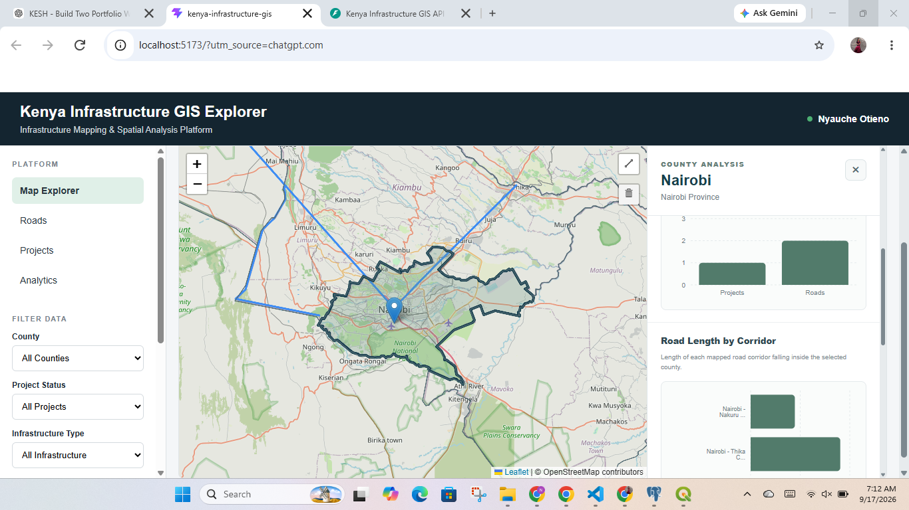

# Kenya Infrastructure GIS Explorer

A full-stack Web GIS application for mapping, managing, visualizing, and spatially analysing infrastructure projects and road corridors across Kenya.

The application combines an interactive React and Leaflet frontend with a FastAPI backend and a PostgreSQL/PostGIS spatial database. County-level infrastructure analysis is performed dynamically using spatial queries rather than relying only on pre-calculated frontend data.
## Live Application

**Live Demo:** https://kenya-infrastructure-gis-web.onrender.com/

**REST API:** https://kenya-infrastructure-gis.onrender.com/

**Interactive API Documentation:** https://kenya-infrastructure-gis.onrender.com/docs

> The API is hosted on a free Render instance and may take approximately 30–60 seconds to wake after a period of inactivity.

---


## Application Preview

The interface below demonstrates county-level spatial analysis for Nairobi. The selected county is highlighted on the interactive Leaflet map while infrastructure statistics and PostGIS-derived road-length analysis are displayed in the County Analysis panel.



The visualization combines interactive web mapping with server-side spatial analysis using PostgreSQL/PostGIS.

---
## Project Overview

The Kenya Infrastructure GIS Explorer was developed as a portfolio project demonstrating the integration of Geographic Information Systems (GIS), web development, spatial databases, REST APIs, and spatial analysis.

Users can explore infrastructure projects and road corridors on an interactive map, display Kenya's county boundaries, select individual counties, and generate county-specific infrastructure statistics.

When a county is selected, the application sends a request to the FastAPI backend. PostGIS then performs spatial operations against the selected county geometry and returns the results to the React frontend for visualization.

---

## Key Features

- Interactive infrastructure map of Kenya
- Kenya county boundary visualization
- County selection, highlighting, and automatic zoom
- Infrastructure project mapping
- Road corridor mapping
- Interactive road drawing
- Project creation, updating, and deletion
- Road creation and deletion
- County and infrastructure filtering
- County-level spatial analysis
- Infrastructure analytics dashboard
- Dynamic charts and statistics
- REST API integration
- PostgreSQL/PostGIS spatial database
- Responsive GIS interface

---

## County Spatial Analysis

One of the core features of the application is dynamic county-level spatial analysis.

When a county is selected, the system determines:

- Infrastructure projects located within or intersecting the county
- Road corridors intersecting the county
- Length of each road corridor falling inside the county
- Total mapped road length within the county
- County population statistics
- Male and female population statistics

The results are displayed in a dedicated County Analysis panel alongside interactive charts.

### Example Analysis

For a selected county such as Nairobi, the application can identify road corridors crossing the county boundary and calculate only the portion of each road located inside Nairobi.

This means that a road extending beyond the county is not treated as though its entire length belongs to that county.

---

## PostGIS Spatial Operations

The backend uses PostGIS functions including:

### `ST_Intersects`

Determines whether infrastructure geometry intersects the selected county boundary.

### `ST_Intersection`

Clips intersecting road geometry to the selected county boundary.

### `ST_CollectionExtract`

Extracts line geometry from the result of the spatial intersection.

### `ST_Length`

Calculates the length of the road geometry located inside the selected county.

### `Geography`

Geometry is cast to the PostGIS `Geography` type before length calculation so that distance can be measured in metres and converted to kilometres.

This workflow allows road-length statistics to be calculated from actual spatial geometry.

---

## Technology Stack

### Frontend

- React
- Vite
- JavaScript
- Leaflet
- React Leaflet
- Leaflet Draw
- Recharts
- HTML5
- CSS3

### Backend

- Python
- FastAPI
- Uvicorn
- SQLAlchemy
- GeoAlchemy2
- Psycopg2

### Spatial Database

- PostgreSQL
- PostGIS

### GIS Data

- GeoJSON
- ESRI Shapefile
- EPSG:4326 / WGS 84
- Point geometry
- LineString geometry
- MultiPolygon geometry

### Development Tools

- Visual Studio Code
- Git
- GitHub
- QGIS
- PostgreSQL/PostGIS

---

## System Architecture

```text
                    USER
                      |
                      v
             React + Leaflet
               Web Interface
                      |
                      |
                 REST API
                      |
                      v
                  FastAPI
                      |
                 SQLAlchemy
                  GeoAlchemy2
                      |
                      v
            PostgreSQL + PostGIS
                      |
          -------------------------
          |           |           |
       Projects      Roads      Counties
        POINT      LINESTRING   MULTIPOLYGON
          |           |           |
          -------- Spatial --------
                  Analysis
                      |
                      v
             JSON / GeoJSON
                      |
                      v
            React Visualization
```

---

## Application Workflow

```text
User selects county
        |
        v
Leaflet captures county ID
        |
        v
React requests county analysis
        |
        v
FastAPI receives request
        |
        v
PostGIS retrieves county geometry
        |
        v
ST_Intersects identifies
projects and roads
        |
        v
ST_Intersection clips roads
to county boundary
        |
        v
ST_Length calculates road
distance inside county
        |
        v
FastAPI returns JSON
        |
        v
React displays statistics,
road information and charts
```

---

## Database Geometry Model

The application uses three primary spatial feature types.

### Projects

```text
Geometry: POINT
SRID: 4326
```

Infrastructure projects are represented by geographic coordinates.

### Roads

```text
Geometry: LINESTRING
SRID: 4326
```

Road corridors are stored as line geometries.

### Counties

```text
Geometry: MULTIPOLYGON
SRID: 4326
```

Kenya's 47 county boundaries are stored as polygon geometries in PostGIS.

---

## County Dataset

The application includes spatial boundaries for Kenya's 47 counties.

County attributes include:

- County name
- Province
- Population
- Male population
- Female population
- Area
- Boundary geometry

The county dataset uses:

```text
Coordinate Reference System: WGS 84
EPSG: 4326
```

---

## Analytics

The application includes an infrastructure analytics dashboard for visualising information such as:

- Total infrastructure projects
- Number of road corridors
- Total mapped road-network length
- Average road-corridor length
- Project status
- Road status
- Road classes
- Road corridor length
- Infrastructure types
- County distribution

County-specific charts are also generated dynamically after a county is selected.

---

## Interactive Road Mapping

Users can draw new road corridors directly on the Leaflet map.

The application captures the drawn coordinates and sends them to the backend, where the road geometry is stored in PostGIS as a `LINESTRING`.

This demonstrates browser-based spatial-data creation in addition to visualization.

---

## REST API

The FastAPI backend provides endpoints for infrastructure and spatial data.

### Projects

```text
GET    /api/projects
POST   /api/projects
PUT    /api/projects/{project_id}
DELETE /api/projects/{project_id}
```

### Roads

```text
GET    /api/roads
POST   /api/roads
DELETE /api/roads/{road_id}
```

### Counties

```text
GET /api/counties
GET /api/counties/{county_id}
GET /api/counties/{county_id}/analysis
```

### API Documentation

When the backend is running locally, interactive FastAPI documentation is available at:

```text
http://127.0.0.1:8000/docs
```

---

## Project Structure

```text
Kenya Infrastucture GIS
|
|-- backend
|   |-- database.py
|   |-- main.py
|   |-- models.py
|   |-- requirements.txt
|
|-- kenya-infrastructure-gis
|   |
|   |-- data
|   |   `-- counties
|   |
|   |-- public
|   |
|   |-- src
|   |   |
|   |   |-- components
|   |   |   |-- AnalyticsDashboard.jsx
|   |   |   |-- CountyAnalysisPanel.jsx
|   |   |   |-- CountyAnalysisPanel.css
|   |   |   |-- CountyBoundaries.jsx
|   |   |   `-- RoadDrawing.jsx
|   |   |
|   |   |-- api.js
|   |   |-- App.jsx
|   |   |-- App.css
|   |   |-- index.css
|   |   |-- infrastructureData.js
|   |   |-- main.jsx
|   |   `-- roadsData.js
|   |
|   |-- package.json
|   `-- vite.config.js
|
|-- .gitignore
`-- README.md
```

---

## Running the Project Locally

### Prerequisites

Install:

- Node.js
- Python
- PostgreSQL
- PostGIS

A PostgreSQL database with the PostGIS extension enabled is required.

---

## Backend Setup

Navigate to the backend:

```powershell
cd backend
```

Create a Python virtual environment:

```powershell
python -m venv venv
```

Activate it on Windows:

```powershell
.\venv\Scripts\Activate.ps1
```

Install dependencies:

```powershell
python -m pip install -r requirements.txt
```

Create a `.env` file inside the backend directory:

```env
DB_HOST=localhost
DB_PORT=5432
DB_NAME=kenya_infrastructure_gis
DB_USER=postgres
DB_PASSWORD=YOUR_POSTGRES_PASSWORD
```

The `.env` file is excluded from Git and should never be committed.

Start the API:

```powershell
python -m uvicorn main:app --reload
```

The backend will be available at:

```text
http://127.0.0.1:8000
```

---

## Frontend Setup

Open another terminal and navigate to the frontend:

```powershell
cd kenya-infrastructure-gis
```

Install dependencies:

```powershell
npm install
```

Start Vite:

```powershell
npm run dev
```

Open:

```text
http://localhost:5173
```

---

## Security

Database credentials are stored using environment variables.

Files containing credentials, Python virtual environments, Node modules, build files, and development caches are excluded from version control through `.gitignore`.

---

## Skills Demonstrated

This project demonstrates practical experience with:

- Web GIS development
- GIS programming
- Spatial database design
- PostGIS spatial queries
- Spatial data visualization
- Spatial intersection analysis
- Geometry clipping
- Geodesic distance calculations
- REST API development
- Full-stack application development
- React application development
- Python backend development
- Interactive mapping
- GeoJSON
- GIS data management
- Git and GitHub version control

---

## Future Development

Potential future enhancements include:

- County-to-county infrastructure comparison
- Advanced spatial filtering
- Infrastructure density analysis
- Buffer analysis
- Nearest-infrastructure analysis
- Additional infrastructure datasets
- Search functionality
- Authentication and user accounts
- Role-based editing
- Data export
- Cloud deployment
- Mobile interface optimization

---

## Author

**Nyauche Otieno**

Geospatial Information Science & Remote Sensing Specialist  
Software & Geospatial Developer

Areas of interest:

- Geographic Information Systems
- Remote Sensing
- Web GIS
- Spatial Databases
- Geospatial Software Development
- Spatial Analysis
- Infrastructure Mapping

---

## Project Status

**Active Development**

The core Web GIS architecture, PostGIS spatial database, infrastructure management tools, county spatial analysis, road clipping, dynamic statistics, and interactive analytics are operational.
